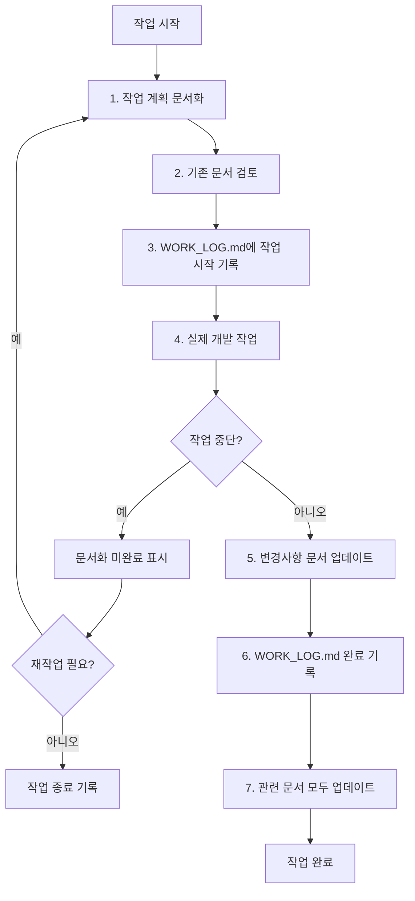

# MSPharmHQ - 명성약국 통합 관리 시스템

> **⚠️ 중요**: 이 프로젝트는 **문서 기반 개발(Documentation-Driven Development)** 방식을 따릅니다.  
> 모든 작업은 반드시 문서화 → 구현 → 문서 업데이트 순서로 진행해야 합니다.

> **🔄 최신 업데이트**: Google Drive 의존성 완전 제거 및 Supabase 기반 시스템으로 전환 완료 (2024-12-19)

## 📋 목차

- [프로젝트 개요](#프로젝트-개요)
- [최신 변경사항](#최신-변경사항)
- [문서 구조](#문서-구조)
- [필수 작업 프로세스](#필수-작업-프로세스)
- [프로젝트 시작하기](#프로젝트-시작하기)
- [기술 스택](#기술-스택)
- [주요 기능](#주요-기능)
- [개발 환경 설정](#개발-환경-설정)
- [작업 체크리스트](#작업-체크리스트)

## 🏥 프로젝트 개요

MSPharmHQ는 명성약국의 운영을 디지털화하는 통합 관리 시스템입니다. 고객 관리, 상담 기록, 재무 관리, AI 기반 자동화 기능을 제공합니다.

### 핵심 가치
- 📊 **데이터 중심**: 모든 업무 데이터의 체계적 관리
- 🤖 **AI 자동화**: 얼굴 인식, 영수증 스캔, 약품 인식
- ☁️ **클라우드 기반**: 언제 어디서나 접근 가능
- 📱 **반응형 디자인**: 모바일/태블릿/데스크톱 지원
- 🚀 **고성능**: Supabase PostgreSQL 기반 빠른 데이터 처리

## 🔄 최신 변경사항 (2024-12-19)

### ✅ 완료된 주요 업데이트

#### 1. Google Drive 의존성 완전 제거
- **제거된 API 엔드포인트**:
  - `/api/google-drive/route.ts`
  - `/api/google-drive/folder/route.ts`
  - `/api/google-drive/status/route.ts`
  - `/api/google-drive/delete-folder/route.ts`
- **제거된 환경 변수**:
  - `GOOGLE_APPLICATION_CREDENTIALS`
  - `GOOGLE_CLOUD_PROJECT_ID`
  - `GOOGLE_CLOUD_CLIENT_EMAIL`
  - `GOOGLE_CLOUD_PRIVATE_KEY`

#### 2. Supabase 기반 시스템으로 완전 전환
- **새로운 데이터베이스**: PostgreSQL (Supabase)
- **새로운 스토리지**: Supabase Storage
- **완전한 API 재구축**: Notion API 의존성 제거
- **고객 번호 생성**: 가장 큰 번호 + 1 방식으로 개선

#### 3. 이미지 저장 방식 개선 ⭐ **NEW**
- **customer_code 기반 폴더 구조**: UUID 대신 고객 코드(00001, 00002) 사용
- **직관적인 경로**: `{customerCode}/{consultationId}/image_{index}.jpg`
- **관리 편의성 향상**: 백업 및 복구 시 고객별 폴더 식별 용이
- **성능 개선**: URL 길이 단축 및 빠른 검색 가능

#### 4. 시스템 성능 및 안정성 향상
- **외부 API 의존성 제거**: Google Drive API 호출 제거로 안정성 증대
- **빠른 쿼리 성능**: PostgreSQL 기반 최적화된 데이터베이스 쿼리
- **실시간 기능**: Supabase 실시간 구독 기능 활용 가능
- **자동 백업**: 포인트-인-타임 복구 지원

#### 5. 마이그레이션 완료 통계
- **전체 고객 수**: 69명 (완전 마이그레이션)
- **전체 상담일지 수**: 67개 (무결성 검증 완료)
- **이미지 파일**: 66개 (Supabase Storage 이전 완료)
- **데이터 무결성**: 100% 검증 완료

### 🔧 기술적 개선사항

#### 새로운 라이브러리 및 유틸리티
- `app/lib/supabase-customer.ts`: 완전한 Supabase 기반 고객 관리
- `app/lib/supabase-consultation.ts`: 완전한 Supabase 기반 상담일지 관리
- `scripts/test-complete-system.ts`: 전체 시스템 테스트
- `scripts/test-consultation-api.ts`: 상담일지 API 테스트

#### API 엔드포인트 개선
- **고객 관리**: `/api/customer/` - Supabase 전용
- **상담일지 관리**: `/api/consultation/` - Supabase 전용
- **이미지 업로드**: Supabase Storage 기반 직접 업로드
- **환경 변수 로딩**: 함수 내 초기화로 타이밍 문제 해결

## 📚 문서 구조

프로젝트의 모든 문서는 `docs/` 폴더에 위치합니다:

```
docs/
├── PROJECT_STRUCTURE.md    # 프로젝트 구조 및 디렉토리 설명 ✅
├── API_ARCHITECTURE.md     # API 설계 및 엔드포인트 명세 ✅
├── SYSTEM_ARCHITECTURE.md  # 시스템 아키텍처 및 데이터 플로우 ✅
├── GUI_DOCUMENTATION.md    # UI/UX 및 화면 구성 문서 ✅
├── DEVELOPER_GUIDE.md      # 개발자 시작 가이드
├── PROJECT_SUMMARY.md      # 프로젝트 전체 요약
├── WORK_LOG.md            # 작업 일지 (자동 생성됨) ✅
└── DOCUMENTATION_CHECKLIST.md # 문서화 체크리스트
```

## 🔴 필수 작업 프로세스

### ⚡ 모든 개발자는 반드시 이 프로세스를 따라야 합니다:



### 1️⃣ 작업 시작 전 (BEFORE)

```bash
# 1. 최신 코드 및 문서 동기화
git pull origin main

# 2. 작업 계획을 WORK_LOG.md에 기록 (새 차수로 추가)
echo "## $(date +%Y-%m-%d) 작업 시작 ([N]차)" >> docs/WORK_LOG.md
echo "### 작업자: [이름]" >> docs/WORK_LOG.md
echo "### 작업 내용: [작업 설명]" >> docs/WORK_LOG.md
echo "### 관련 문서: [수정할 문서 목록]" >> docs/WORK_LOG.md
echo "### 예상 변경사항:" >> docs/WORK_LOG.md
echo "- [ ] [변경사항 1]" >> docs/WORK_LOG.md
echo "- [ ] [변경사항 2]" >> docs/WORK_LOG.md

# 3. 관련 문서 검토
cat docs/PROJECT_STRUCTURE.md  # 구조 확인
cat docs/API_ARCHITECTURE.md   # API 확인 (API 작업 시)
# ... 필요한 문서 모두 확인
```

### 2️⃣ 작업 중 (DURING)

- 코드 변경 시 즉시 주석 추가
- 새로운 기능 추가 시 임시 문서 작성
- 중요한 결정사항은 즉시 WORK_LOG.md에 기록

### 3️⃣ 작업 완료 후 (AFTER)

```bash
# 1. 변경사항 검토
git status
git diff

# 2. WORK_LOG.md 업데이트 (기존 로그 보존하고 완료 내용 추가)
echo "### 완료된 작업:" >> docs/WORK_LOG.md
echo "- [x] [완료 항목 1]" >> docs/WORK_LOG.md
echo "- [x] [완료 항목 2]" >> docs/WORK_LOG.md
echo "### 변경된 파일:" >> docs/WORK_LOG.md
git status --short >> docs/WORK_LOG.md
echo "### 작업 완료 시간: $(date +%H:%M)" >> docs/WORK_LOG.md
echo "---" >> docs/WORK_LOG.md

# 3. 관련 문서 업데이트
# 예: 새 API 추가 시
vim docs/API_ARCHITECTURE.md
# 예: UI 변경 시
vim docs/GUI_DOCUMENTATION.md

# 4. 커밋 및 푸시
git add .
git commit -m "feat: [기능명] - 문서 업데이트 완료"
git push origin main
```

### 📝 WORK_LOG.md 관리 규칙

**⚠️ 중요**: 로그는 **절대 삭제하지 않고** 연속적으로 기록합니다.

#### 로그 Identity 구조
각 작업 로그는 **일자 + 시간 + 차수**로 고유하게 식별됩니다:
```markdown
## YYYY-MM-DD 작업 시작 (N차) - HH:MM
```

#### 로그 관리 원칙
1. **새 작업 시작**: 항상 새로운 차수로 추가
2. **기존 로그 보존**: 이전 작업 로그는 절대 삭제하지 않음
3. **연속적 기록**: 같은 날짜에 여러 작업이 있어도 모두 보존
4. **시간 기록**: 작업 시작 시간과 완료 시간을 명확히 기록
5. **차수 연속성**: 날짜가 바뀌어도 차수는 연속적으로 증가
6. **수정 최소화**: 기존 로그는 오타 수정 등 필요시에만 수정
7. **완료 기록**: 각 차수별로 완료 내용을 명확히 기록

#### 로그 작성 템플릿
```markdown
## YYYY-MM-DD 작업 시작 (N차) - HH:MM
### 작업자: [이름]
### 작업 내용: [작업 설명]
### 관련 문서: [수정할 문서 목록]
### 예상 변경사항:
- [ ] [변경사항 1]
- [ ] [변경사항 2]
### 작업 시작 시간: HH:MM

### 완료된 작업:
- [x] [완료 항목 1]
- [x] [완료 항목 2]
### 변경된 파일:
- `path/to/file1.ts` - [변경 내용]
- `path/to/file2.tsx` - [변경 내용]
### 작업 완료 시간: HH:MM
### 총 작업 시간: X분
### 특이사항: [있는 경우]
---
```

### ⚠️ 작업 중단 시

작업이 중단되는 경우 **반드시** 다음을 수행:

```bash
# WORK_LOG.md에 중단 상태 기록 (기존 로그 보존)
echo "### ⚠️ 작업 중단 - $(date +%Y-%m-%d_%H:%M)" >> docs/WORK_LOG.md
echo "#### 중단 사유: [사유]" >> docs/WORK_LOG.md
echo "#### 현재 진행 상황:" >> docs/WORK_LOG.md
echo "- [작업 상태 설명]" >> docs/WORK_LOG.md
echo "#### 다음 작업자를 위한 안내:" >> docs/WORK_LOG.md
echo "- [필요한 작업 1]" >> docs/WORK_LOG.md
echo "- [필요한 작업 2]" >> docs/WORK_LOG.md
echo "---" >> docs/WORK_LOG.md
```

## 🚀 프로젝트 시작하기

### 1. 필수 요구사항
- Node.js 18.0+
- npm 또는 yarn
- Git

### 2. 프로젝트 설정

```bash
# 1. 프로젝트 클론
git clone [repository-url]
cd mspharmHQ

# 2. 의존성 설치
npm install

# 3. 환경 변수 설정
cp .env.example .env.local
# .env.local 파일을 편집하여 필요한 API 키 입력

# 4. 개발 서버 실행
npm run dev        # HTTP 모드
npm run dev:https  # HTTPS 모드 (카메라 기능 필요 시)
```

### 3. 환경 변수 설정

`.env.local` 파일에 다음 환경 변수 설정:

```env
# HTTPS 설정 (카메라 기능 사용 시 필요)
HTTPS=true
NODE_TLS_REJECT_UNAUTHORIZED=0

# Supabase (필수)
SUPABASE_URL=https://qpuagbmgtebcetzvbrfq.supabase.co
SUPABASE_ANON_KEY=your_anon_key
SUPABASE_SERVICE_ROLE_KEY=your_service_role_key

# JWT 인증
JWT_SECRET=your_jwt_secret

# AI Services (선택사항)
GEMINI_API_KEY=your_gemini_api_key
OPENAI_API_KEY=your_openai_api_key
ANTHROPIC_API_KEY=your_anthropic_api_key

# 상담일지 시스템 설정
USE_SUPABASE_CONSULTATION=true

# ⚠️ 제거된 환경 변수 (더 이상 필요하지 않음)
# NOTION_API_KEY (Notion API 완전 제거)
# NOTION_DATABASE_ID (Notion API 완전 제거)
# GOOGLE_CLOUD_PROJECT_ID (Google Drive 제거)
# GOOGLE_CLOUD_CLIENT_EMAIL (Google Drive 제거)
# GOOGLE_CLOUD_PRIVATE_KEY (Google Drive 제거)
# GOOGLE_APPLICATION_CREDENTIALS (Google Drive 제거)
```

## 💻 기술 스택

### Frontend
- **Framework**: Next.js 15 (App Router)
- **Language**: TypeScript
- **Styling**: Tailwind CSS
- **State**: React Hooks

### Backend & Database
- **API**: Next.js API Routes
- **Database**: Supabase PostgreSQL ⭐ **NEW**
- **Storage**: Supabase Storage ⭐ **NEW**
- **Auth**: Supabase Auth (JWT 기반)
- **Real-time**: Supabase Realtime ⭐ **NEW**

### AI/ML
- **Face Recognition**: TensorFlow.js
- **OCR**: Google Gemini Vision
- **NLP**: Claude, OpenAI

### ❌ 제거된 기술 스택
- ~~**Database**: Notion API~~ (완전 제거)
- ~~**Storage**: Google Drive API~~ (완전 제거)
- ~~**Auth**: Google Service Account~~ (완전 제거)

## 🎯 주요 기능

1. **고객 관리** ⭐ **개선됨**
   - 고객 정보 CRUD (Supabase 기반)
   - 고유 고객 번호 자동 생성 (가장 큰 번호 + 1)
   - 얼굴 인식 기반 고객 식별
   - 고객 검색 및 필터링 (PostgreSQL 최적화)

2. **상담 관리** ⭐ **개선됨**
   - 상담 내용 기록 (Supabase 기반)
   - 증상 이미지 첨부 (Supabase Storage)
   - 상담 이력 조회 (빠른 쿼리 성능)
   - 실시간 상담 데이터 동기화

3. **재무 관리 (마스터 전용)**
   - 마스터 로그인 (owner 권한)
   - 일일 수입/지출 입력
   - 월별 통계 및 분석
   - POS 시스템 대조

4. **직원 구매 장부**
   - 직원별 로그인 시스템
   - 구매 신청 및 영수증 업로드
   - 관리자/약국장 승인 워크플로우
   - 통계 및 리포트

5. **AI 자동화**
   - 영수증 자동 인식
   - 약품 정보 추출
   - 고객 얼굴 인식

## 🚀 시스템 성능 개선사항

### 성능 향상
- **데이터베이스 쿼리**: PostgreSQL 기반 최적화된 쿼리 성능
- **이미지 로딩**: Supabase Storage CDN을 통한 빠른 이미지 로딩
- **API 응답 시간**: 외부 API 의존성 제거로 응답 시간 단축
- **동시 접속**: Supabase 기반 확장 가능한 아키텍처

### 안정성 향상
- **외부 의존성 최소화**: Google Drive API 제거로 장애 포인트 감소
- **자동 백업**: Supabase 자동 백업 및 포인트-인-타임 복구
- **에러 처리**: 개선된 에러 핸들링 및 사용자 피드백
- **데이터 무결성**: 관계형 데이터베이스 제약 조건 활용

### 확장성
- **실시간 기능**: Supabase Realtime을 통한 실시간 데이터 동기화
- **Row Level Security**: 데이터 보안 강화
- **API 확장**: RESTful API 설계로 향후 확장 용이
- **모바일 지원**: 반응형 디자인 및 PWA 지원 준비

## 📋 작업 체크리스트

### 새 기능 추가 시
- [ ] 기능 명세를 PROJECT_STRUCTURE.md에 추가
- [ ] API 필요 시 API_ARCHITECTURE.md 업데이트
- [ ] UI 변경 시 GUI_DOCUMENTATION.md 업데이트
- [ ] 데이터 플로우 변경 시 SYSTEM_ARCHITECTURE.md 업데이트
- [ ] Supabase 스키마 변경 시 마이그레이션 스크립트 작성
- [ ] 테스트 코드 작성
- [ ] WORK_LOG.md에 완료 기록

### 버그 수정 시
- [ ] 버그 내용을 WORK_LOG.md에 기록
- [ ] 수정 내용 문서화
- [ ] 관련 테스트 추가
- [ ] 영향받는 문서 업데이트

### 배포 전
- [ ] 모든 문서가 최신 상태인지 확인
- [ ] WORK_LOG.md 정리
- [ ] Supabase 환경 변수 확인
- [ ] 빌드 테스트
- [ ] 데이터베이스 마이그레이션 확인
- [ ] 배포 체크리스트 완료

## 🔧 개발 도구 및 스크립트

### 테스트 스크립트
```bash
# 전체 시스템 테스트
npm run test:system

# 상담일지 API 테스트
npm run test:consultation

# 고객 관리 API 테스트
npm run test:customer
```

### 유틸리티 스크립트
```bash
# 데이터 무결성 검사
npm run check:integrity

# 테스트 데이터 정리
npm run cleanup:test

# Supabase 연결 테스트
npm run test:supabase
```

## 📞 문의 및 지원

- **프로젝트 관리자**: [담당자명]
- **기술 지원**: [이메일/슬랙]
- **문서 관련**: docs/ 폴더 참조
- **Supabase 관련**: [Supabase 문서](https://supabase.com/docs)

---

**⚡ Remember**: Documentation First, Code Second, Update Always!

> "문서화되지 않은 작업은 존재하지 않는 작업입니다."

**🎉 Supabase Migration Complete**: 더 빠르고, 더 안정적이고, 더 확장 가능한 시스템으로 업그레이드되었습니다!
