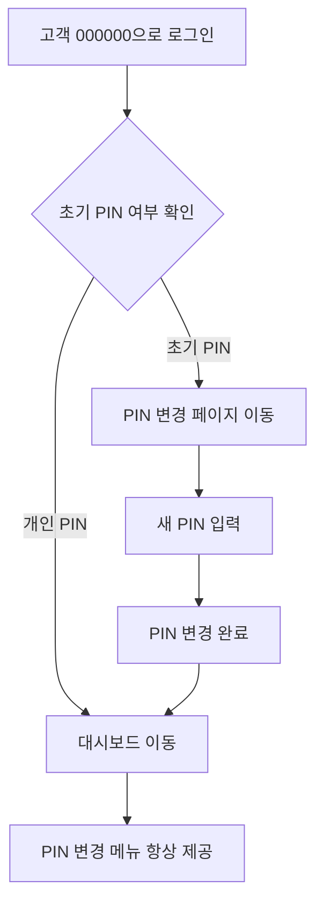

# 고객 PIN 관리 가이드

## 🔑 PIN 시스템 개요

### 초기 PIN 000000 시스템

모든 고객은 초기 PIN으로 `000000`을 사용하며, 최초 로그인 시 보안을 위해 PIN을 변경해야 합니다.

### PIN 변경 플로우



## 📋 설정 방법

### 1. 데이터베이스 스키마 적용

Supabase SQL Editor에서 `database/update_pin_functions.sql` 실행:

```sql
-- 기존 PIN 생성 함수가 000000으로 초기화되도록 수정
-- 모든 고객에게 자동으로 000000 PIN 생성
```

### 2. 초기 PIN 일괄 생성

```sql
-- 모든 활성 고객에게 초기 PIN 생성
DO $$
DECLARE
    customer_record RECORD;
    result_pin VARCHAR(6);
BEGIN
    FOR customer_record IN 
        SELECT id, name, customer_code 
        FROM customers 
        WHERE is_deleted = FALSE
    LOOP
        result_pin := create_customer_pin(customer_record.id);
        RAISE NOTICE '고객: % (%) - 초기 PIN: %', 
            customer_record.name, 
            customer_record.customer_code, 
            result_pin;
    END LOOP;
END $$;
```

### 3. PIN 상태 확인

```sql
-- 초기 PIN 사용 고객 확인
SELECT 
    c.customer_code,
    c.name,
    cp.pin_code,
    cp.is_initial_pin,
    cp.created_at
FROM customer_pins cp
JOIN customers c ON cp.customer_id = c.id
WHERE cp.is_active = TRUE
ORDER BY cp.is_initial_pin DESC, c.customer_code;
```

## 👤 사용자 경험

### 약사 관점

1. **고객 등록 시**: 자동으로 000000 PIN 생성
2. **고객 안내**: "초기 PIN은 000000입니다. 첫 로그인 시 변경하시면 됩니다"
3. **PIN 문의 시**: 고객이 PIN을 잊었다면 다시 000000으로 초기화 가능

### 고객 관점

1. **최초 접속**: 000000 입력
2. **PIN 변경 유도**: 자동으로 PIN 변경 페이지 이동
3. **새 PIN 설정**: 6자리 개인 PIN 설정
4. **이후 로그인**: 설정한 개인 PIN 사용

## 🔧 관리 기능

### PIN 초기화 (약사용)

특정 고객의 PIN을 000000으로 초기화:

```sql
-- 고객 PIN 초기화
SELECT create_customer_pin(
    (SELECT id FROM customers WHERE customer_code = '00001')
) as reset_pin;
```

### PIN 변경 이력 확인

```sql
-- 고객의 PIN 변경 이력
SELECT 
    cp.pin_code,
    cp.is_initial_pin,
    cp.is_active,
    cp.created_at,
    cp.updated_at
FROM customer_pins cp
JOIN customers c ON cp.customer_id = c.id
WHERE c.customer_code = '00001'
ORDER BY cp.created_at DESC;
```

## 🛡️ 보안 고려사항

### PIN 복잡성

- 6자리 숫자 조합
- 생일, 전화번호 등 추측하기 쉬운 번호 피하도록 안내
- 000000, 111111, 123456 등 단순한 패턴 사용 금지

### PIN 변경 정책

- 초기 PIN(000000) 사용 시 강제 변경
- 대시보드에서 언제든 PIN 변경 가능
- 중복 PIN 사용 방지

### 분실 시 대응

1. **고객이 PIN을 잊은 경우**:
   - 약사가 000000으로 초기화
   - 고객에게 직접 안내
   - 다시 PIN 변경하도록 유도

2. **보안 의심 시**:
   - 즉시 PIN 초기화
   - 새로운 PIN 설정 안내

## 📱 API 엔드포인트

### 로그인 API
```
POST /api/customer/auth/login
- pin: string (6자리)
- 응답: { requiresPinChange: boolean, customer: {...} }
```

### PIN 변경 API
```
POST /api/customer/auth/change-pin
- currentPin: string (6자리)
- newPin: string (6자리)
- 응답: { success: boolean, customer: {...} }
```

## 🔄 운영 시나리오

### 시나리오 1: 신규 고객
1. 약사가 고객 등록 → 자동으로 000000 PIN 생성
2. 고객에게 "초기 PIN은 000000입니다" 안내
3. 고객이 첫 로그인 → 자동으로 PIN 변경 페이지
4. 개인 PIN 설정 완료 → 정상 서비스 이용

### 시나리오 2: PIN 분실
1. 고객이 PIN을 잊었다고 문의
2. 약사가 SQL로 PIN 초기화 (000000으로 리셋)
3. 고객에게 "PIN이 000000으로 초기화되었습니다" 안내
4. 고객이 로그인 → 다시 PIN 변경

### 시나리오 3: 보안 문제
1. PIN 노출 의심 시
2. 약사가 즉시 PIN 초기화
3. 고객에게 긴급 연락하여 새 PIN 설정 안내

## ✅ 장점

1. **사용 편의성**: 모든 고객이 동일한 초기 PIN으로 시작
2. **보안성**: 강제 PIN 변경으로 개인화
3. **관리 편의성**: 약사가 쉽게 PIN 초기화 가능
4. **확장성**: 추후 더 복잡한 인증 시스템으로 확장 가능

---

**🔐 안전하고 편리한 PIN 관리 시스템 완성!**
